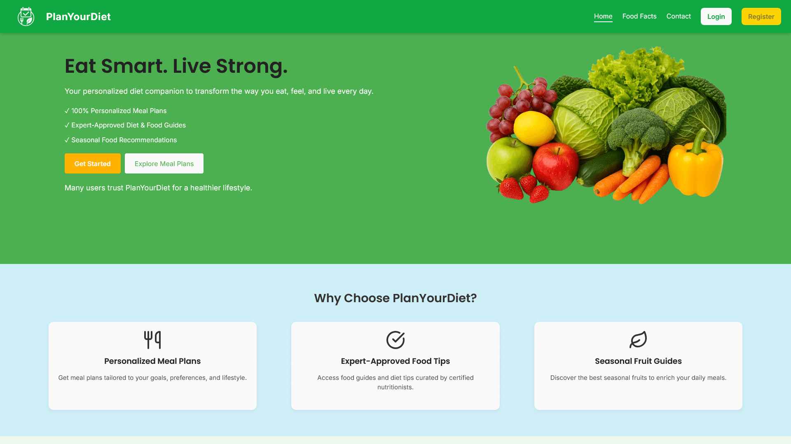
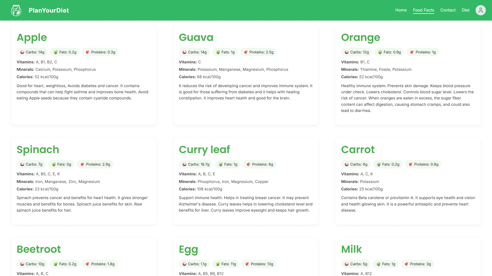
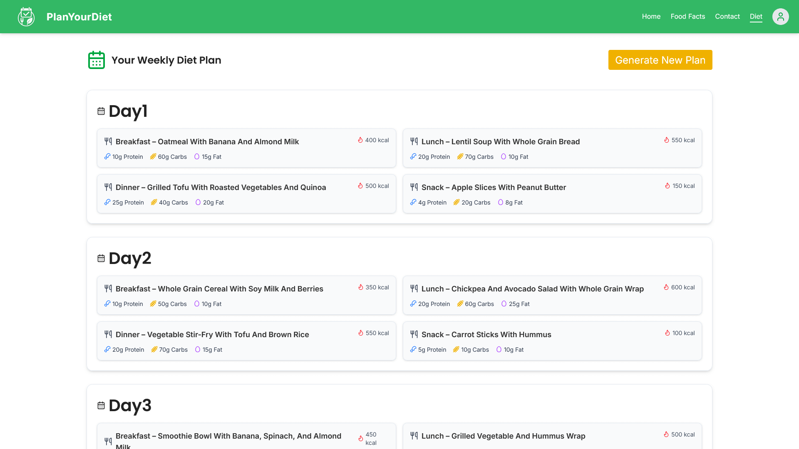
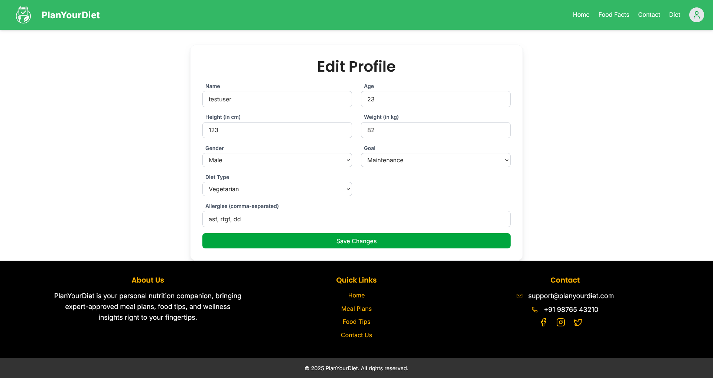
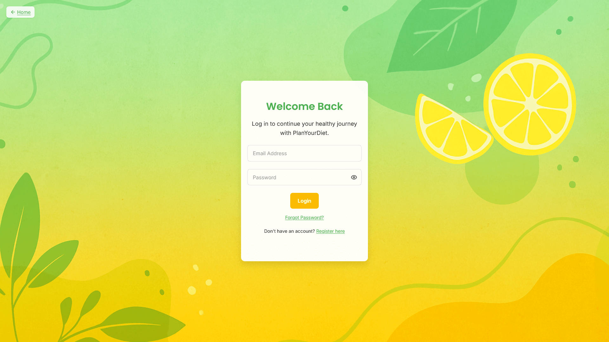

# PlanYourDiet

**PlanYourDiet** is a full-stack AI-driven diet planning application that allows users to receive personalized weekly diet plans based on their goals, preferences, and allergies.

## Preview

### Home Page and Food Tips
<p align="center">
  
  
</p>

### Diet Plan and Edit Profile
<p align="center">
  
  
</p>

### Login and Register
<p align="center">
  
  
</p>

---

## Tech Stack

- **Frontend**: React.js, Tailwind CSS, React Hook Form, Zod, axios
- **Backend**: Node.js, Express.js, Prisma ORM
- **Database**: PostgreSQL
- **Authentication**: JWT (access + refresh tokens)
- **AI Integration**: Together.ai (LLaMA 3 70B) for meal plan generation

---

## Features

- User Registration & Login
- Profile Setup: age, weight, height, diet type, allergies, etc.
- AI-generated 7-day weekly meal plans (macros + calories)
- View meals categorized by day and time (breakfast/lunch/etc.)
- Regenerate plans when needed
- JWT Authentication with refresh token auto-renewal, setup using axios interceptors and react context API
- responsive UI

---

## Setup Instructions

### 1. Clone the Repository

```bash
git clone --depth 1 https://github.com/praneeth-katuri/plan-your-diet.git
cd plan-your-diet
```

### 2. Setup Backend

```bash
cd server
npm install
cp .env.example .env   # add your secrets into .env (IMPORTANT)

# Migrate DB
npx prisma migrate dev

# Start server
npm run dev
```

### 3. Setup Frontend

```bash
cd ../client
npm install
npm run dev
```

---


## Planned Improvements

- PDF export for diet plans
- Dark mode support
- Nutrition label suggestions
- AI chatbot for food alternatives

---

## License

MIT © 2025 [Praneeth Katuri](LICENSE)
